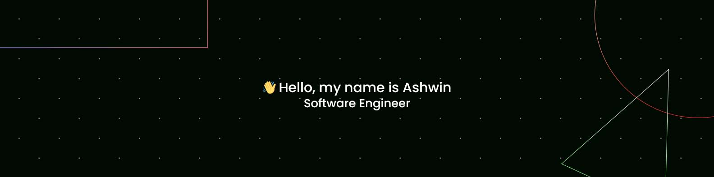

Hello! I'm Ashwin, a dedicated Software Engineer passionate about backend development and driving innovation through robust features. Here's a glimpse into my journey:

## 🎓 Education:
- **Bachelor in Technology** in Electronics and Communication from [SCT](https://www.sctce.ac.in/): Laid the foundation for my tech career.

## 💼 Professional Journey:
- **Software Engineer** at [Codeofduty Innovations](https://www.codeofduty.in/):
  - Developed robust features for Ryng, a cutting-edge product.
- **Freelance Technical Advisor**
  - Developed and maintained web applications using React and Node.js.
  - Collaborated with cross-functional teams to implement new features.
- **Artificial Intelligence Intern** at [Accubits](https://accubits.com/):
  - Pioneered AI-driven solutions with potential industry revolutionizing impact.

## 🌱 Passion & Skills:
- Thrive on challenges, always eager to upskill.
- Passionate about creating innovative solutions.
- Excited to collaborate on projects pushing technology boundaries.

## 📂 Portfolio:
- Explore my projects and more at [Bento](https://bento.me/ashwinmanoj).

## 📫 Let's Connect:
- [LinkedIn](https://www.linkedin.com/in/ashwinm-045/)
- [Medium](https://medium.com/@ashes192000)

Let's embark on a journey of learning and innovation together! 🚀
